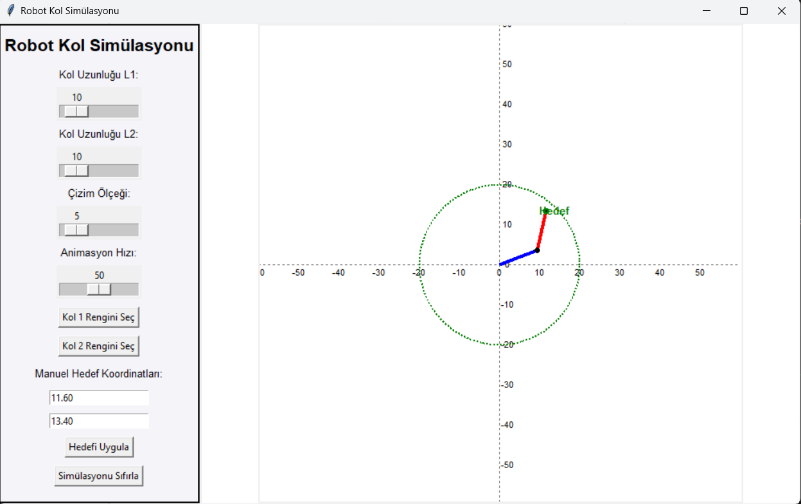

[![Forks][forks-shield]][forks-url]
[![Stargazers][stars-shield]][stars-url]
[![Issues][issues-shield]][issues-url]
<a href="https://www.linkedin.com/in/hilmi-can-ürlü-6a7855329" target="_blank">
    
  </a>


<!-- PROJECT LOGO -->  
<br />  
<p align="center">  
  <a>  
      
  </a>

  <h3 align="center">Robot Kol Simülasyonu ve Öne Kinematik Uygulaması</h3>

  <p align="center">  
    Robot kol kontrolü ve görselleştirilmesi için kapsamlı bir simülasyon!  
    <br />  
    <a href="https://github.com/HilmiCanUrlu/Robot-Arm-Simulation-and-Forward-Kinematics-Application"><strong>Dokümantasyonu Keşfedin »</strong></a>  
    <br />  
    <br />  
    <a href="https://github.com/HilmiCanUrlu/Robot-Arm-Simulation-and-Forward-Kinematics-Application">Demo'yu Görüntüle</a>  
    ·  
    <a href="https://github.com/HilmiCanUrlu/Robot-Arm-Simulation-and-Forward-Kinematics-Application/issues">Hata Bildir</a>  
    ·  
    <a href="https://github.com/HilmiCanUrlu/Robot-Arm-Simulation-and-Forward-Kinematics-Application/issues">Özellik Talep Et</a>  
  </p>  
</p>  

<!-- ABOUT THE PROJECT -->  
## Genel Bakış  

Bu proje, Python ve Tkinter kullanarak 2D robot kolunun grafiksel simülasyonunu sağlar. Öne ve ters kinematik kavramlarını gösterir ve kullanıcıların simülasyonla etkileşime girmesini sağlar, manuel koordinatlar girerek veya doğrudan kanvasa tıklayarak.

### Özellikler  
- **Etkileşimli Simülasyon**: Kullanıcılar, robot kolunu fare tıklamalarıyla veya manuel girişlerle kontrol edebilir.  
- **Öne Kinematik**: Eklemler açısına dayalı olarak sonuçlanan pozisyonu görselleştirin.  
- **Özelleştirilebilir Arayüz**: Tema seçimi ve uyarlanabilir görselleri destekler.  

### Kullanılan Teknolojiler  
Bu proje aşağıdaki teknolojileri kullanmaktadır:  
- [Python](https://www.python.org/)  
- [Tkinter](https://wiki.python.org/moin/TkInter)  
- [Numpy](https://numpy.org/)

<!-- GETTING STARTED -->  
## Başlarken

Bu projeyi yerel olarak kurmak için aşağıdaki adımları izleyin.

### Gereksinimler

Python'un sisteminizde kurulu olduğundan emin olun:
```sh
python --version
```
Gerekli bağımlılıkları kurun:
```sh
pip install -r requirements.txt
```

Kurulum
1. Depoyu klonlayın:
```sh
git clone https://github.com/HilmiCanUrlu/Robot-Arm-Simulation-and-Forward-Kinematics-Application.git
```
2. Proje dizinine gidin:
```sh
cd Robot-Arm-Simulation
```
3. Simülasyonu çalıştırın:
```sh
python robot_arm_simulation.py
```

<!-- USAGE EXAMPLES -->
Kullanım
Programı python main.py komutuyla başlatın.
Kanvas üzerinde tıklayarak robot kolunu istenen pozisyonlara yönlendirin.
Eklemler açısını manuel olarak girin ve gerçek zamanlı sonuçları görün.

Daha fazla örnek için, lütfen [Dokümantasyona](https://github.com/HilmiCanUrlu/Robot-Arm-Simulation-and-Forward-Kinematics-Application/wiki)_ bakın 

<!-- ROADMAP -->
## 🚧 Yol Haritası

- [ ] 3D simülasyon desteği eklemek.
- [ ] Büyük ölçekli simülasyonlar için performansı iyileştirmek.
- [ ] Dinamik engel kaçınma eklemek.

Önerilen özellikler (ve bilinen sorunlar) için [açık sorunlara](https://github.com/HilmiCanUrlu/Robot-Arm-Simulation-and-Forward-Kinematics-Application/issues) bakın.

<!-- CONTRIBUTING -->
## 🤝 Katkı Sağlamak

Katkılar, açık kaynak topluluğunu bu kadar değerli kılan unsurlardır. Yapacağınız her katkı **büyük takdirle karşılanacaktır**.

1. Projeyi çatallayın.
2. Özellik dalınızı oluşturun (`git checkout -b feature/AmazingFeature`).
3. Değişikliklerinizi commitleyin (`git commit -m 'Add some AmazingFeature'`).
4. Dala push yapın (`git push origin feature/AmazingFeature`).
5. Bir pull request açın.

<!-- LICENSE -->
## 🖋️ Lisans

MIT Lisansı altında dağıtılmaktadır. Daha fazla bilgi için `LICENSE` dosyasına bakın.

<!-- CONTACT -->
## 📧 İletişim

Hilmi Can Ürlü- [@UrluCan](https://x.com/UrluCan) - Urluhilmi7@gmail.com

Proje Linki: [https://github.com/HilmiCanUrlu/Robot-Arm-Simulation-and-Forward-Kinematics-Application](https://github.com/HilmiCanUrlu/Robot-Arm-Simulation-and-Forward-Kinematics-Application)

<!-- ACKNOWLEDGEMENTS -->
## Teşekkürler


- [Numpy](https://numpy.org/)
- [Matplotlib](https://matplotlib.org/)
- [Tkinter Documentation](https://wiki.python.org/moin/TkInter)

<!-- MARKDOWN LINKS & IMAGES -->
<!-- https://www.markdownguide.org/basic-syntax/#reference-style-links -->
[forks-shield]: https://img.shields.io/github/forks/HilmiCanUrlu/Robot-Arm-Simulation-and-Forward-Kinematics-Application?style=for-the-badge
[forks-url]: https://github.com/HilmiCanUrlu/Robot-Arm-Simulation-and-Forward-Kinematics-Application/network/members
[stars-shield]: https://img.shields.io/github/stars/HilmiCanUrlu/Robot-Arm-Simulation-and-Forward-Kinematics-Application?style=for-the-badge
[stars-url]: https://github.com/HilmiCanUrlu/Robot-Arm-Simulation-and-Forward-Kinematics-Application/stargazers
[issues-shield]: https://img.shields.io/github/issues/HilmiCanUrlu/Robot-Arm-Simulation-and-Forward-Kinematics-Application?style=for-the-badge
[issues-url]: https://github.com/HilmiCanUrlu/Robot-Arm-Simulation-and-Forward-Kinematics-Application/issues
