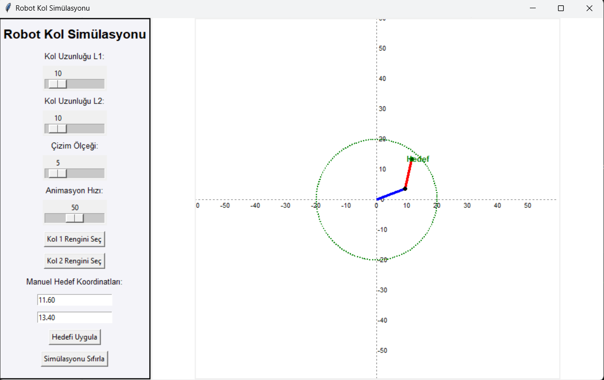

[![Forks][forks-shield]][forks-url]
[![Stargazers][stars-shield]][stars-url]
[![Issues][issues-shield]][issues-url]
[![LinkedIn][linkedin-shield]][linkedin-url]


<!-- PROJECT LOGO -->
<br />
<p align="center">
  <a>
    
  </a>

  <h3 align="center">Robot Arm Simulation and Forward Kinematics Application</h3>

  <p align="center">
    A comprehensive simulation for robotic arm control and visualization!
    <br />
    <a href="https://github.com/HilmiCanUrlu/Robot-Arm-Simulation-and-Forward-Kinematics-Application"><strong>Explore the docs »</strong></a>
    <br />
    <br />
    <a href="https://github.com/HilmiCanUrlu/Robot-Arm-Simulation-and-Forward-Kinematics-Application">View Demo</a>
    ·
    <a href="https://github.com/HilmiCanUrlu/Robot-Arm-Simulation-and-Forward-Kinematics-Application/issues">Report Bug</a>
    ·
    <a href="https://github.com/HilmiCanUrlu/Robot-Arm-Simulation-and-Forward-Kinematics-Application/issues">Request Feature</a>
  </p>
</p>

<!-- ABOUT THE PROJECT -->
## Overview

This project provides a graphical simulation of a 2D robotic arm using Python and Tkinter. It demonstrates forward and inverse kinematics concepts and allows users to interact with the simulation by inputting manual coordinates or clicking directly on the canvas.

### Features
- **Interactive Simulation**: Users can control the robotic arm by mouse clicks or manual inputs.
- **Forward Kinematics**: Visualize the resulting position based on joint angles.
- **Customizable Interface**: Supports theme selection and adaptable visuals.

### Built With
This project leverages the following technologies:
- [Python](https://www.python.org/)
- [Tkinter](https://wiki.python.org/moin/TkInter)
- [Numpy](https://numpy.org/)

<!-- GETTING STARTED -->
## Getting Started

To set up this project locally, follow these steps.

### Prerequisites

Ensure Python is installed on your system:
```sh
python --version
```
Install necessary dependencies:
```sh
pip install -r requirements.txt
```

### Installation

1. Clone the repository:
```sh
git clone https://github.com/HilmiCanUrlu/Robot-Arm-Simulation-and-Forward-Kinematics-Application.git
```
2. Navigate to the project directory:
```sh
cd Robot-Arm-Simulation
```
3. Run the simulation:
```sh
python main.py
```

<!-- USAGE EXAMPLES -->
## Usage

1. Start the program using `python main.py`.
2. Use the canvas to click and direct the robotic arm to desired positions.
3. Input joint angles manually in the provided fields to see real-time results.

_For more examples, please refer to the [Documentation](https://github.com/HilmiCanUrlu/Robot-Arm-Simulation-and-Forward-Kinematics-Application/wiki)_

<!-- ROADMAP -->
## 🚧 Roadmap

- [ ] Add 3D simulation support.
- [ ] Improve performance for large-scale simulations.
- [ ] Add dynamic obstacle avoidance.

See the [open issues](https://github.com/HilmiCanUrlu/Robot-Arm-Simulation-and-Forward-Kinematics-Application/issues) for a list of proposed features (and known issues).

<!-- CONTRIBUTING -->
## 🤝 Contributing

Contributions make the open-source community such a valuable resource. Any contributions you make are **greatly appreciated**.

1. Fork the project
2. Create your feature branch (`git checkout -b feature/AmazingFeature`)
3. Commit your changes (`git commit -m 'Add some AmazingFeature'`)
4. Push to the branch (`git push origin feature/AmazingFeature`)
5. Open a pull request

<!-- LICENSE -->
## 🖋️ License

Distributed under the MIT License. See `LICENSE` for more information.

<!-- CONTACT -->
## 📧 Contact

Your Name - [@your_twitter](https://twitter.com/your_username) - your_email@example.com

Project Link: [https://github.com/HilmiCanUrlu/Robot-Arm-Simulation-and-Forward-Kinematics-Application](https://github.com/HilmiCanUrlu/Robot-Arm-Simulation-and-Forward-Kinematics-Application)

<!-- ACKNOWLEDGEMENTS -->
## Acknowledgements

- [Numpy](https://numpy.org/)
- [Matplotlib](https://matplotlib.org/)
- [Tkinter Documentation](https://wiki.python.org/moin/TkInter)

<!-- MARKDOWN LINKS & IMAGES -->
<!-- https://www.markdownguide.org/basic-syntax/#reference-style-links -->
[forks-shield]: https://img.shields.io/github/forks/HilmiCanUrlu/Robot-Arm-Simulation-and-Forward-Kinematics-Application?style=for-the-badge
[forks-url]: https://github.com/HilmiCanUrlu/Robot-Arm-Simulation-and-Forward-Kinematics-Application/network/members
[stars-shield]: https://img.shields.io/github/stars/HilmiCanUrlu/Robot-Arm-Simulation-and-Forward-Kinematics-Application?style=for-the-badge
[stars-url]: https://github.com/HilmiCanUrlu/Robot-Arm-Simulation-and-Forward-Kinematics-Application/stargazers
[issues-shield]: https://img.shields.io/github/issues/HilmiCanUrlu/Robot-Arm-Simulation-and-Forward-Kinematics-Application?style=for-the-badge
[issues-url]: https://github.com/HilmiCanUrlu/Robot-Arm-Simulation-and-Forward-Kinematics-Application/issues
[linkedin-shield]: https://img.shields.io/badge/-LinkedIn-black.svg?style=flat-square&logo=linkedin&colorB=555
[linkedin-url]: https://linkedin.com/in/your-profile
